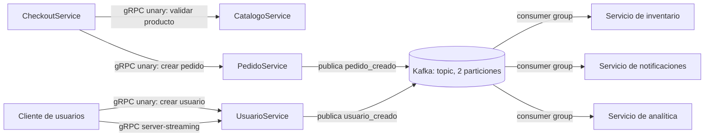

# Mini-arquitectura de microservicios

## Diagrama

El diagrama representa ambos dominios de la entrega: para el ejemplo de usuarios se usa `usuarios-eventos`; para pedidos, `pedidos-eventos`. `CheckoutService` y `CatalogoService` muestran una interacción síncrona interna típica entre microservicios (el checkout necesita validar el producto antes de aceptar el pedido). Esa llamada está en el diseño de arquitectura; el código ejecutable de esta actividad implementa los servicios gRPC de usuarios y pedidos, no un catálogo separado. El producer y los consumers también se pueden ejecutar por separado para observar explícitamente las dos particiones y el reparto del grupo.

## Justificación

Se utiliza gRPC para las operaciones que necesitan una respuesta inmediata. Cuando un cliente solicita crear un usuario o un pedido, envía un mensaje tipado definido en Protocol Buffers y recibe una respuesta estructurada. El método unary es apropiado para confirmar el resultado de esa operación, mientras que el método server-streaming permite que clientes conectados reciban nuevas creaciones sin estar consultando repetidamente al servidor. El contrato `.proto` documenta los mensajes y métodos, y el código generado evita serializar manualmente las solicitudes y respuestas.

Kafka se utiliza para distribuir los eventos que ocurren después de crear una entidad. El servicio publica `usuario_creado` o `pedido_creado` en su topic y consumidores independientes pueden procesarlo para actualizar inventario, enviar notificaciones o alimentar analítica. El productor no necesita conocer ni esperar la implementación de cada consumidor, por lo que los servicios quedan desacoplados y pueden escalar según su carga. El topic tiene dos particiones; dos consumidores que pertenecen al mismo grupo pueden procesar particiones distintas en paralelo, como se demuestra con los scripts incluidos. Para este laboratorio se ejecuta un broker local de un solo nodo; en producción se usaría un clúster con replicación y configuración de seguridad apropiadas.

En síntesis, gRPC resuelve la comunicación síncrona con contrato explícito y respuesta inmediata; Kafka resuelve la comunicación asíncrona basada en eventos y la distribución a varios consumidores. Los ejemplos ejecutables muestran la creación, la transmisión y el procesamiento local de estos mensajes.
